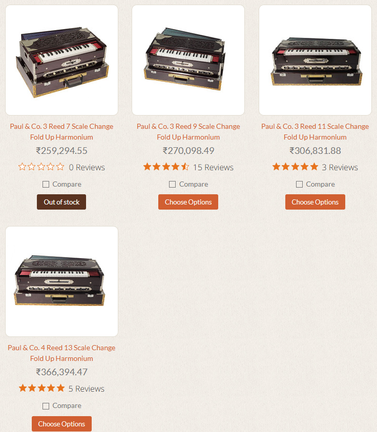

Paul & Co. Harmonium Overview
Paul & Co. is a renowned Indian manufacturer based in Kolkata, celebrated for crafting some of the finest Kolkata-style harmoniums in the world.  These instruments are highly sought after by professional musicians, kirtan artists, and classical performers due to their superior craftsmanship, rich tonal quality, and durability.  Each harmonium is handcrafted using aged teak wood and fitted with premium Palitana reeds, known for their bright, resonant sound and long sustain. 

Paul & Co. harmoniums are distinguished by their precision engineering, attention to detail, and traditional construction methods passed down through generations.  The company produces both 3-reed and 4-reed models, with most being scale changers, allowing performers to transpose the key for vocal compatibility. 

Paul & Co. Harmonium, company

View all

Paul & Co. Harmonium review and demonstration

View all
Popular Paul & Co. Harmonium Models
1. 9-Scale Changer, 3-Reed Model
This is the standard professional model offered by Paul & Co., widely regarded as one of the best entry-level concert harmoniums.  It features:

3 reed banks: Bass, Male, and Female
9-position scale changer (adjustable from G# to E)
4 stops and 5–7 drones for tonal control
Left-action octave coupler
7-fold bellows for smooth, consistent airflow
37 keys (3.5 octaves)
Traditional collapsing suitcase design with teak wood construction
Includes a padded gig bag 
This model is ideal for classical, devotional, and kirtan music, offering excellent tuning stability and a warm, full sound.

Paul & Co 9 scale changer 3 reed harmonium

View all
2. 13-Scale Changer, 4-Reed Model
A higher-end concert model designed for advanced players needing greater flexibility:

4 reed sets: Bass, Male, Male, Female (B-M-M-F)
13-position scale changer for maximum key versatility
11 stops and coupler function
3.5 octaves (37 keys)
Multi-fold bellows for easy pumping and sustained sound
Mahogany-colored teak wood body
Instant-response keyboard
Ships with a padded travel bag 
This model delivers a richer, more layered sound due to the additional reed set and is favored by touring artists and recording professionals. 

Paul & Co 13 scale changer 4 reed harmonium

View all
Authenticity and Purchasing Tips
Due to the brand's reputation, counterfeit Paul & Co.  harmoniums are common. To ensure authenticity:

Purchase from authorized dealers who source directly from the Paul workshop in Kolkata. 
Look for hand-carved details, high-quality brass reeds, and smooth mechanical action.
Reputable sellers often test and tune each instrument before shipping (typically to A440 pitch, with 432Hz available on request). 
Avoid third-party sellers without verifiable sourcing, as many offer imitation models with inferior materials and sound quality. 

Paul & Co. harmonium real vs fake site:reddit.com

View all

Copy

more info

Finished
Paul & Co. Harmonium – Additional Details
Craftsmanship and Production
Paul & Co. harmoniums are handcrafted in Kolkata, India, under the supervision of Batta Krishna Paul, who inherited the craft from his father, Kshitij Chandra Paul.  Each instrument takes several months to complete, with only a limited number produced monthly due to meticulous handwork.  The harmoniums are built using seasoned teak wood, ensuring durability and resistance to warping, and feature Palitana reeds—renowned for their rich, warm, and sustained tone. 

Paul & Co. Harmonium, company

View all
Model Specifications
3-Reed, 9-Scale Changer
Reed Banks: Bass (horizontal), Male, Female (vertical)
Scale Changer: 9 positions (G# to E)
Keys: 37 (F#2 to F#5), two-piece construction
Stops: 4 (Bass, Male, Female, Tremolo)
Drones: 7
Coupler: Left-action
Bellows: 7-fold, premium leather
Weight: ~39.5 lbs (18 kg)
Dimensions: 25.75 x 16 x 8.5 in. (closed)
Tuning: Typically A440 Hz (432 Hz available on request)
Finish: Glossy teak or dark mahogany 
This model is widely used in bhajans, kirtans, and classical performances, including by artists performing with spiritual leaders like Amma. 

Paul & Co 3 reed 9 scale harmonium

View all
4-Reed, 13-Scale Changer
Reed Banks: Bass, Male, Male, Female (B-M-M-F)
Scale Changer: 13 positions (F# to F#)
Stops: 11
Coupler: Reverse-facing (left-action)
Bellows: Multifold
Weight: ~45 lbs (20.5 kg)
Tuning: A440 Hz standard; wet tuning recommended for optimal resonance
Sound Profile: Fuller, more layered tone due to dual male reeds 
This top-tier model is often described as the "Rolls-Royce of harmoniums", ideal for professional recording and concert use. 

Paul & Co 4 reed harmonium demonstration

View all
Authenticity and Purchasing
Due to widespread counterfeits, it's crucial to buy from authorized dealers who source directly from Paul’s workshop.  Reputable sellers:

Provide video verification from Paul Babu himself
Test, tune, and refine each instrument before shipping
Offer detailed inspection and secure packaging
Supply a padded gig bag 
Avoid mass-market platforms where fake models are common. Trusted dealers include Old Delhi Music, Kala Kendar, and The Amma Shop.

Please note : Over the last few months we have noticed a website selling H Paul & Co. harmoniums. H Paul & Co. are not the legendary Paul & Co. harmoniums. Paul babu has no website. Please beware of the quality and shipping of those harmoniums. We have received many complains.

Paul & Co. harmoniums need no introduction. Their harmoniums have been ranked among the finest in the world for generations. They are especially well known for making scale change harmoniums. Musician’s Mall, formerly the Ali Akbar College Store has been importing and selling authentic Paul & Co. harmoniums for over a quarter of a century. You can shop with confidence, knowing that we supply only genuine Paul and Co. instruments. 

   Battakrishna Paul learned the art of harmonium making from his father, the late Sri Kshitish Chandra Paul, a violinist and disciple of Ustad Allauddin Khan. After finishing his schooling, he immediatelyembarked upon a career as a harmonium maker, building on the knowledge he had learned from his father about tuning and the overall construction of the harmonium. With this basic knowledge, he began expanding his vision of what a harmonium should sound like. Paul and Co. harmoniums are acclaimed by many well-known singers for their elegance of sound as well as their durability. Only the finest hard wood is used for the internal construction, which means their longevity is second to none.

   

https://www.youtube.com/watch?v=gSpbyxFx2EU